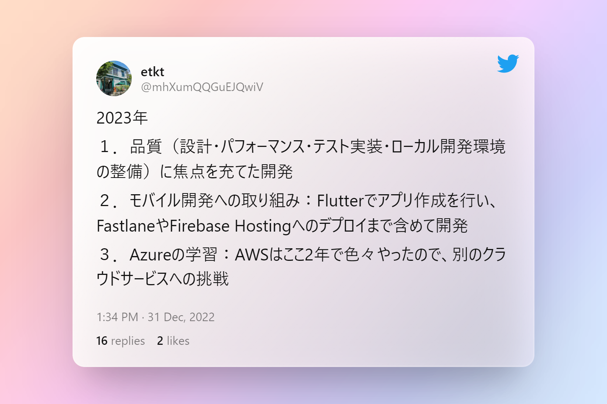

## Authors
- [@eno-conan](https://github.com/eno-conan)

## 🛠 Skills
Java, Python, TypeScript, next(React), Flutter(Beginner)
AWS, Azure(Beginner) 

## 🚀 About Me
I'm a full stack developer...


## 2023年の抱負


# 自分の記録作成・閲覧サイト

自分が行ってきた学習について、記録を残すために作成したサイト
## Tech Stack

**Client:** 
Next, Zod, TailwindCSS, Radix, playwright, storybook

**Server:** 
TypeScript, prisma, supabase,vitest, msw

## Deployment

To deploy this project run

```bash
  npm run deploy
```
## Run Locally

Clone the project

```bash
  git clone https://link-to-project
```

Go to the project directory

```bash
  cd my-project
```

Install dependencies

```bash
  npm install
```

Start the server

```bash
  npm run dev
```

Format Code src Folder 

```bash
  npm run format2
```


## Usage/Examples

```javascript
import Component from 'my-project'

function App() {
  return <Component />
}
```

### create-next-app
- [23/01/10：アプリ作成方法](https://mo-gu-mo-gu.com/create-next-app-typescript/)
- [23/01/11：アプリ作成方法(ESlintの設定も含めて)](https://qiita.com/mu-suke08/items/28fefe92b113c8f1c25d)
- [23/01/11：ESlintの設定](https://qiita.com/sochan-dev/items/525539b5dc7e4d7f814b)
  - Vercelにデプロイしたら、以下エラーが発生したので、`react/no-unescaped-entities`を1(warning)に設定
  ```
  Error: `'` can be escaped with `&apos;`, `&lsquo;`, `&#39;`, `&rsquo;`.  react/no-unescaped-entities
  ```
- [23/01/16：Next.jsでのサイト内ページ遷移方法](https://qiita.com/IYA_UFO/items/f13577bad7dd9ef1ae89)
- [23/01/16：dependenciesとdevDependencies](https://prograshi.com/framework/nodejs/dependencies-and-devdependencies-in-package-json/)
- [23/01/16：Auth.jsのOAuth認証をNext.jsで試す](https://dev.classmethod.jp/articles/auth_js/)
- [23/01/16：Loadingの実装](https://qiita.com/ykkamm/items/4fd4a7bed03e81f07b64)
- [23/01/17：Sleep機能実装方法](https://lost-in-code.com/ja/tutorials/js/sleep/)

### tools
- [23/02/01：知らないと損する生産性向上に役立つツール](https://zenn.dev/nameless_sn/articles/awesome_sites_for_development?s=09)
- [favicon.io](https://favicon.io/favicon-converter/)
- [README作成ツール](https://readme.so/ja/editor)
- [ツイート画像表示](https://poet.so/)

### Eslint,Rome,Config
- [23/01/11：no-consoleの設定](https://eslint.org/docs/latest/rules/no-console?s=09)
- [23/01/12：disabling rules](https://nextjs.org/docs/basic-features/eslint#disabling-rules)
- [23/01/12：react/display-name](https://cpoint-lab.co.jp/article/202107/20652/)
- [23/01/17：skipLibCheckの設定はtrue?false?](https://t-yng.jp/post/skiplibcheck)
- [23/01/17：VSCode show errors for unresolved types in .d.ts files?](https://stackoverflow.com/questions/70905791/is-there-a-way-to-make-vscode-show-errors-for-unresolved-types-in-d-ts-files)
- [23/01/22：Rome formatter linter(公式)](https://rome.tools/)
- [23/01/22：Rome formatter linterとは](https://qiita.com/rana_kualu/items/47341ce38b3df6a75559)
- [23/01/22：Rome formatter linterコマンドの使い方](https://www.youtube.com/watch?v=uHET9O-E51c)

### env variables
- [23/01/11：envファイルの定義](https://fwywd.com/tech/next-env)

### StoryBook
- [23/01/10：インストール、初期設定](https://reffect.co.jp/react/next-js-12-storybook)
- [23/01/11：getServerSidePropsとの連携方法](https://egghead.io/lessons/next-js-mock-getserversideprops-and-getstaticprops-request-with-msw-and-storybook-loaders)

### MSW,HTTP
- [23/01/10：インストール、初期設定](https://zenn.dev/higuchimakoto/articles/d9865193910046)
  - mswインストール
    - `npm install msw --save-dev`
  - Workderの生成
    - `npx msw init public/ --save`
  - mocksフォルダを作成（記事の中にはない）し、サーバおよびDummyデータの設定
  - `jest.setup.js`にMockサーバ定義
  - `pages/_app.tsx`にMockを読み込みするか、条件分岐を設定
  - envファイルの作成し、以下を設定
    - `.env.local`
      - NEXT_PUBLIC_API_MOCKING=enabled
    - `.env.production`
      - NEXT_PUBLIC_API_MOCKING=disabled
- [23/01/17：axiosによるGET,POST）](https://www.sukerou.com/2019/05/axios.html)
- [23/01/17：axiosからredaxiosへbundleサイズを抑えられるらしい）](https://www.builder.io/blog/safe-data-fetching?s=09)
- [23/01/17：wretchのgithub](https://github.com/elbywan/wretch)

### React Form Hooks
- [23/01/13：基本メソッド一覧](https://qiita.com/NozomuTsuruta/items/0140acaee87b7c4ed856)
- [23/01/13：ハンズオン記事1](https://zenn.dev/t_keshi/articles/react-query-prescription)
- [23/01/18：REACT-YMD-DATE-SELECT(一覧画面で日付の検索情報で使えるかも)](https://whitphx.github.io/react-ymd-date-select/)
- [23/01/18：Hookとif文の関係性](https://reactjs.org/docs/hooks-rules.html#explanation)

### React Query
- [23/01/17：最適化1](https://tech.techtouch.jp/entry/react-query-optimization)

### tanStackQuery
- [23/01/17：公式](https://tanstack.com/query/latest)
- [23/01/17：パフォーマンスについて](https://tech.techtouch.jp/entry/react-query-performance-issue)
- [23/01/17：SWRとの違い：大きくある訳ではない](https://almonta2021blog.com/nextjs-swr-tanstackquery/)
- [23/01/17：ReactのSuspenseを用いて、loadingやerrorの表示](https://almonta2021blog.com/nextjs-swr-tanstackquery/)
  - suspenseを使うと、`loadingであればXXXを表示`といった実装は要らなくなる
- [23/01/17：cacheTimeとstaleTime(初級)](https://www.azukipan.com/posts/react-react-query-staletime-cachetime/)
- [23/01/17：cacheTimeとstaleTime](https://zenn.dev/helloiamktn/articles/166f15d1b5fa4b)
- [23/01/17：Caching Examples(公式)](https://tanstack.com/query/v4/docs/react/guides/caching?from=reactQueryV3&original=https%3A%2F%2Freact-query-v3.tanstack.com%2Fguides%2Fcaching)
- [23/01/17：テーブル実装](https://dev.classmethod.jp/articles/react-table/)
- [23/01/17：ページネーション(公式)](https://tanstack.com/query/v4/docs/react/guides/paginated-queries)
- [23/01/22：Infinite Queries(実装例)](https://dev.to/nischal_dutt/paginated-infinite-queries-182p)

### Zod
- [23/01/15：公式ドキュメント](https://zod.dev/)
- [23/01/15：API側のバリデーション（動画）](https://www.youtube.com/watch?v=_K34O0NcKAM)
- [23/01/15：transformの使用例（プルダウンを用いた場合の値送信）](https://zenn.dev/kaz_z/articles/react-hook-form-select)
- [23/01/16：柔軟なバリデーション実装（パスワード・確認用パスワードの実装方法）](https://zenn.dev/nyatinte/articles/ade85843d6d460?s=09)
- [23/01/16：Zorm - Type safe <form> for React using Zod](https://reactjsexample.com/zorm-type-safe-form-for-react-using-zod/)

### Vitest
- [23/01/11：インストール、初期設定](https://zenn.dev/elpnt/scraps/5051d7e06bdd6a)

### Layout,tailwind css
- [23/01/12：インストール、初期設定](https://tailwindcss.com/docs/guides/nextjs)
- [23/01/12：classnames.bindを使用した動的なクラス名設定](https://gist.github.com/heygrady/316bd69633ce816aee1ca24ab63535db#example-3-with-classnamesbind)
- [23/01/16：レイアウト調整](https://tech-machi-log.com/tailwindcss-flexbox/)
- [23/01/16：ローディングデザイン](https://zenn.dev/catnose99/articles/19a05103ab9ec7)
- [23/01/16：モダンなCSSの書き方](https://zenn.dev/taku_matsunaga/articles/c85a44757b46c9)
- [23/01/16：Header,Footer,layoutの実装方法](https://reactjsexample.com/a-starter-template-designed-to-get-up-and-running-with-a-next-js-powered-blog/)
- [23/01/18：flexの実装](https://runebook.dev/ja/docs/tailwindcss/flex-wrap)
- [23/01/18：幅の設定方法](https://runebook.dev/ja/docs/tailwindcss/width)
- [23/01/19：flex-grow、flex-shrink、flex-basis](https://miyattiblog.com/explanation-of-flex-property/)
- [23/01/19：Flowbite公式](https://flowbite-react.com/)
- [23/01/19：[React] Flowbite を使ってみる](https://neko-note.org/react-flowbite-install/1058)
- [23/01/19：[React] FlowbiteでTableを表示](https://neko-note.org/react-tailwind-flowbite-table/1264)
  - 公式のコード使った方がよさそう
- [23/01/19：React Tableとの連携](https://dev.to/oloriasabi/how-to-create-table-with-data-grid-checkbox-and-pagination-using-react-table-and-tailwind-css-33c)
- [23/01/21：テーブルのレスポンシブ対応](https://larainfo.com/blogs/tailwind-css-hidden-display-none-class-example)
- [23/01/29：角が取れた優しいデザインへ1](https://preline.co/docs/tables.html)
- [23/01/29：角が取れた優しいデザインへ1](https://www.geeksforgeeks.org/tailwind-css-table-layout/?ref=lbp)

### radix
- [23/01/12：インストール、初期設定](https://www.radix-ui.com/docs/primitives/overview/getting-started)
- 23/01/12：@import '@radix-ui/colors/violet.css';の実装箇所
  - `XXX.module.css`に記載すると、以下エラーが表示されてしまう
  ```
  Syntax error: Selector ":root" is not pure (pure selectors must contain at least one local class or id)
  ```
  - 解決方法
    - **globals.cssに記述すればいい**

### playwright
- [23/01/11：インストール、初期設定](https://playwright.dev/docs/intro)
- [23/01/11：基本操作関連の実装](https://zenn.dev/optimisuke/articles/f38ea76006d3a6)

### supabase
- [23/01/15：prismaとの連携](https://zenn.dev/kuesato/articles/8da958751b52fb)
- [23/01/15：prismaと少し実装](https://qiita.com/takux/items/4a3640e67753268652d1)
- [23/01/16：Triggers機能を使用しユーザー情報をデータベースに自動登録](https://dev.classmethod.jp/articles/supabase-triggers/?s=09)
- [23/01/17：ConnectorError: prepared statement \"s0\" already exists when connecting to pgbouncer with sslへの対処](https://github.com/prisma/prisma/issues/4752)

### prisma
- [23/01/15：Vercelでデータ投入できるために必要な設定](https://github.com/prisma/prisma/issues/4752)
- [23/01/15：ページングの実装（skipとtakeを併用）](https://www.prisma.io/docs/concepts/components/prisma-client/pagination)

### Performance,Lighthouse
- [23/01/15：Accessibility:Buttons do not have an accessible nameの対処方法](https://t-kuni-tech.com/2020/12/21/lighthouse%E3%81%AE%E3%80%8Cbuttons-do-not-have-an-accessible-name%E3%80%8D%E3%81%AE%E5%AF%BE%E5%87%A6%E6%96%B9%E6%B3%95/)
- [23/01/15：Accessibility:Form elements do not have associated labelsの対処方法](https://zenn.dev/damono999/articles/f41d51048ef268)
- [23/01/15：Page is blocked from indexingの対処方法](https://developer.chrome.com/docs/lighthouse/seo/is-crawlable/)
- [23/01/19：再レンダリングを防ぐ実装](https://zenn.dev/azukiazusa/articles/react-rerender-patterns)
  - リフトダウンパターン
  - リフトアップパターン
  - memoパターン
- [23/01/20：memoをコンポーネントに付与して再レンダリングを防ぐ方法](https://zenn.dev/azukiazusa/articles/react-rerender-patterns)
- [23/01/20：memo化の使いどころ](https://cam-inc.co.jp/p/techblog/530551646413914939)
  - なんでもかんでもmemo化せず、設計再検討の上で使用
- [23/01/26：@next/bundle-analyzer](https://zenn.dev/catnose99/scraps/661d77118aa2af)

### i18n
- [23/01/16：サンプルコード](https://github.com/hisho/nextjs-with-zod-i18n/tree/main/)
- [23/01/16：Internationalized Routing](https://nextjs.org/docs/advanced-features/i18n-routing)
